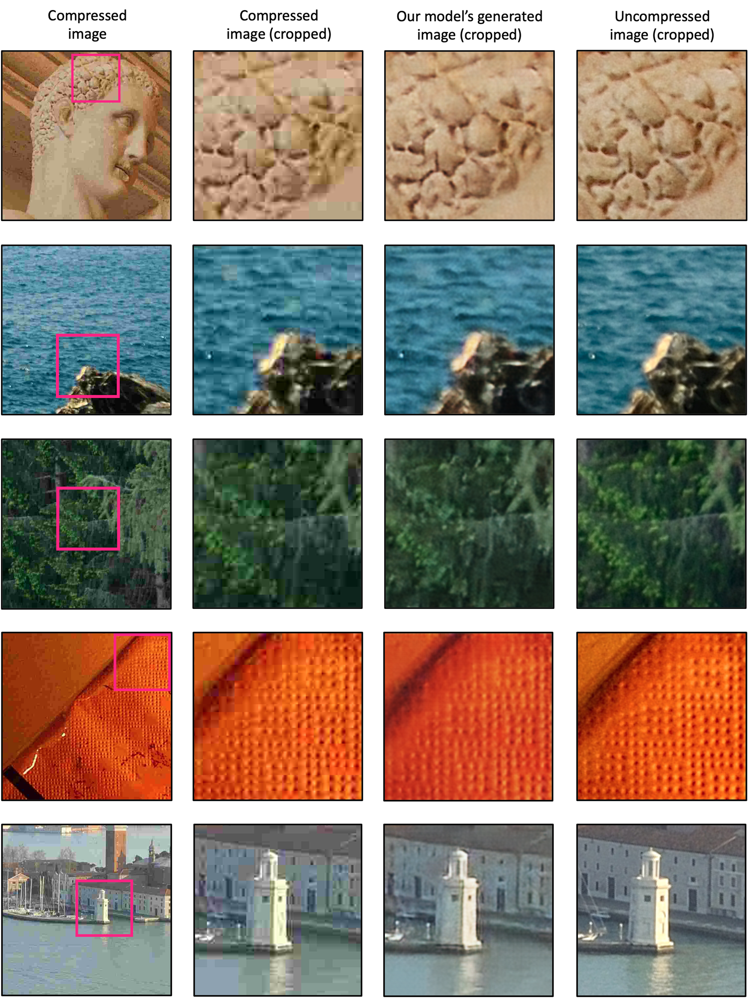
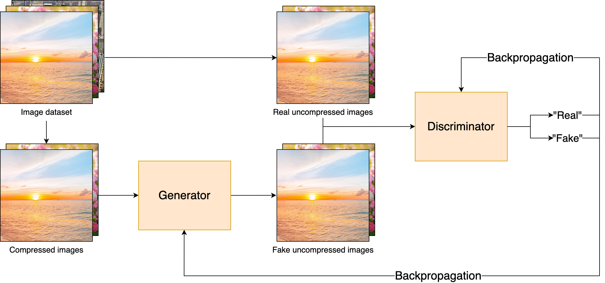
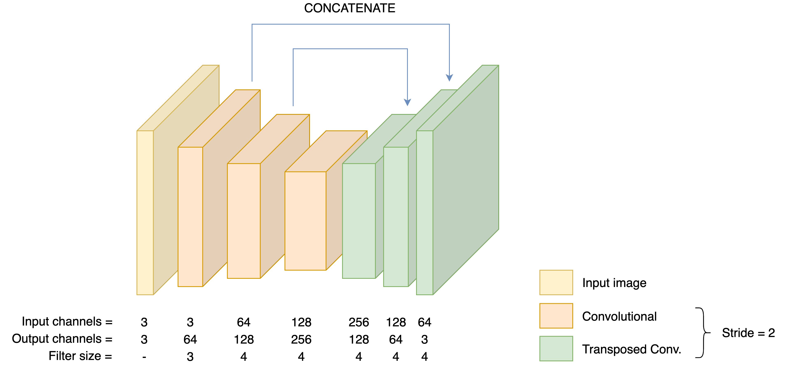
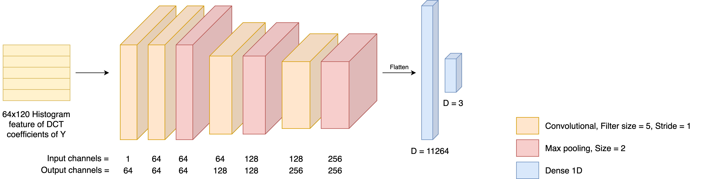
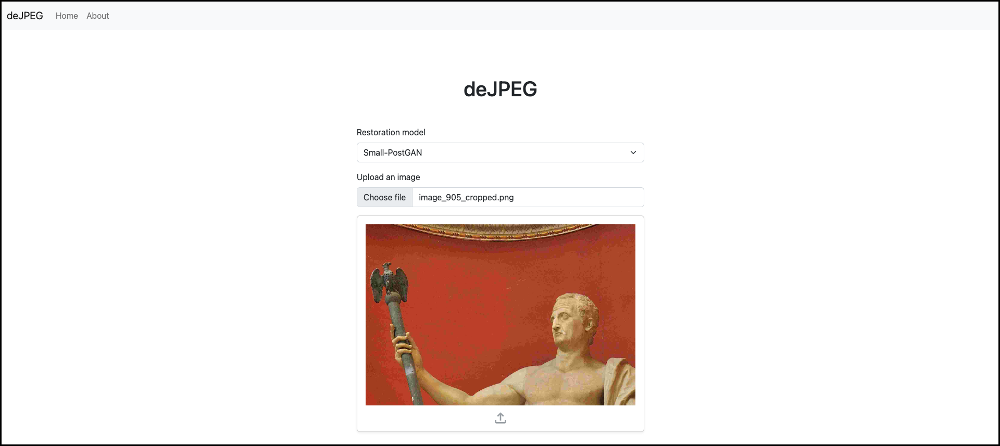
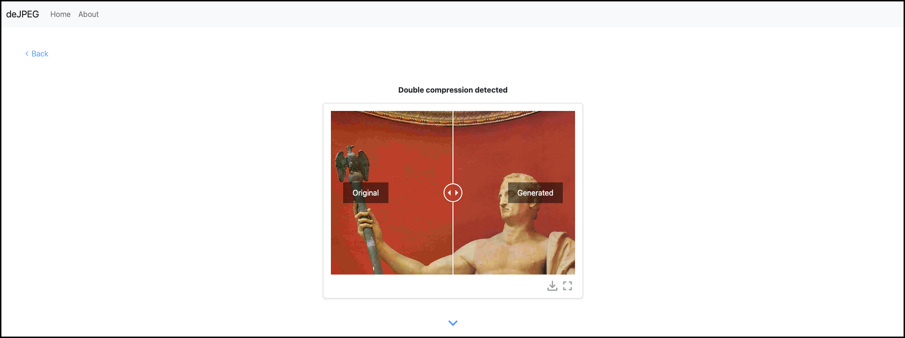
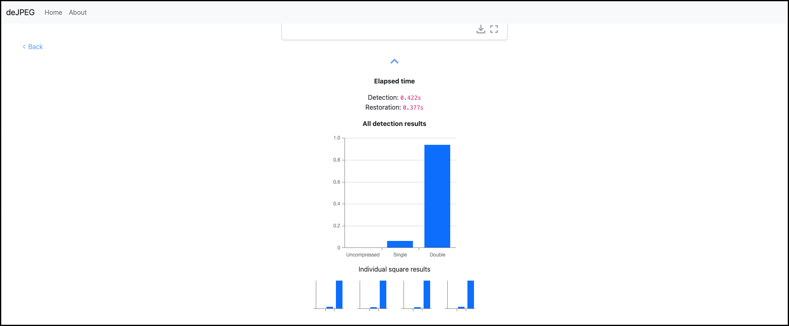
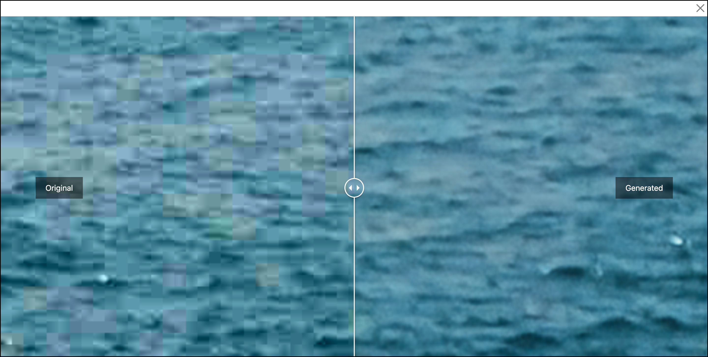

# deJPEG

Using **de**ep learning to **de**tect JPEG compression and **de**-artifact an image. 

##### Table of Contents  
[1. About](#1-about)  
[2. Setup Instructions](#2-setup-instructions)  
[3. Files Included](#3-files-included)  
[4. Dataset](#4-dataset)    

## 1. About

This is a project for my Computer Science (MEng) dissertation at the University of Warwick, entitled, "JPEG compression detection and restoration". 

We developed a system that can reverse the degradation of quality of JPEG compressed images. In particular, the system can detect whether an image has undergone JPEG compression using solely pixel information. If compression is detected, a JPEG artifact removal process is invoked. 

Our detector CNN model achieves near state-of-the-art accuracy in the task, despite using a smaller and simpler architecture compared to existing solutions. 

Our restorer GAN model was able to outperform a previous state-of-the-art method for JPEG artifact removal as we employed NoGAN training and introduced a novel perceptual loss function, which incorporates information from multiple scales using MS-SSIM and considers deep semantic features extracted from a pretrained VGG-19 network.

The models can be used using the demo website part of this repo. See section 1 for setup instructions.

Read the dissertation [here](ai-research/dissertation/dissertation.pdf).

**Restored image examples**



## 1.1 Models

**GAN for restoration**

GAN architecture:


Generator architecture:


**CNN for detection**



## 1.2 Demo website

There is a demo website to showcase the models. It uses a React frontend and Flask beackend. The website can be setup following instructions in Section 1. Once setup, you should be able to access the website and use the models. It looks as follows: 

Submitting an image: 


After submitting an image: 


Results information: 


Fullscreen result: 


## 2. Setup Instructions

The frontend and backend should each be setup/run in separate terminal windows. Note that these instructions are designed for Linux/MacOS.

### 2.1 Frontend
#### 2.1.1 Setup
Prerequisites: Node.js is installed on your machine.
1. Go to `./client` directory
2. Install Node dependencies with:
    ```bash
    npm install
    ```

#### 2.1.2 Run
1. Ensure you are in the `./client` directory.
2. Start React app with: 
    ```bash
    npm start
    ```

Kill the app by closing your terminal window.

### 2.2 Backend
#### 2.2.1 Setup
Prerequisites: Python 3 is installed on your machine.
1. Go to `./server` directory
2. Install Virtualenv using: (Skip this if you already have Virtualenv)
    ```bash
    pip install virtualenv
    ```
3. Create a Python virtual environment with:
    ```bash
    python -m venv venv
    ```
    MacOS users may have to use:
    ```bash
    python3 -m venv venv
    ```
4. Activate the virtual environment with:
    ```bash
    source venv/bin/activate
    ```
5. Install Python dependencies with:
    ```bash
    pip install -r requirements.txt
    ```

#### 2.2.2 Run
1. Ensure you are in the `./server` directory.
2. Activate the virtual environment with: 
    ```bash
    source venv/bin/activate
    ```
3. Start the Flask server with:
    ```bash
    flask run
    ```
    Alternatively, use: 
    ```bash
    python app.py
    ```
    Ensure that the port the server is running on is 5000. If it is not, use:
    ```bash
    flask run -h localhost -p 5000
    ```

Kill the server by closing your terminal window. 

### 2.3 Train own models (optional)
To use the dataset in Google Colab, you must first create a shortcut to the dataset folder in your own Google Drive (see Section 3 for more information on the dataset).
1. Open the dataset folder link: https://drive.google.com/drive/folders/1hP3Nbg-x6DOwkWMLgNvOtNUT16AuaMd-?usp=share_link
2. In the `dataset` folder dropdown, select "Add shortcut to Drive". Select your desired location to add the shortcut.

To train your own version of the proposed models:
1. Upload the relevant Jupyter notebook in `./ai-research` to Google Colab
2. In the notebook, modify the PATH variable in the first cell such that it refers to your Google Drive shortcut of the dataset folder `[...]/dataset/`.
3. Run the whole notebook.

The trained model will be saved (as a folder) in the same directory as the notebook. If you wish to use the model in the website:
1. Move the model folder to your desired location in Google Drive (using Colab's file manager).
2. In Google Drive, download the model folder.
3. Manually move the model folder to `./server/ml/models/` and replace an existing model in the directory (renaming the model folder to the same name as the model being replaced).

Note: The notebooks were developed with a Google Colab Pro subscription, so "High-RAM" GPUs were used. The runtime may run out of RAM without High-RAM GPUs.

Note: The experiments in the report for training the restorer were limited to 80,000 steps (100 epochs) due to time constraints (and a desire to conduct numerous experiments). However, better results can still be obtained by training for longer - a welcome bonus!

## 3. Files Included
 As agreed with the project supervisor (Victor Sanchez), we include the website code and the code to train the final models.

* The Jupyter notebooks to train the proposed models can be found in the `./ai-research` folder. We have also included the notebooks that obtain and preprocess our dataset to show how we achieved our system requirement **M1**.
    * `detector.ipynb` is for training our proposed detector model
    * `restorer.ipynb` is for training our proposed restorer model
    * `download.ipynb` is for downloading and compressing images from the RAISE dataset
    * `preprocess.ipynb` is for preprocessing different versions of the images for our dataset

* The React.js code for the frontend can be found in the `./client` folder.

* The Flask, TensorFlow 2, and image preprocessing code for the backend can be found in the `./server` folder. Some pretrained models are also included.

* Additionally, some demo images taken from our dataset are included in the `./demo` folder.

### 3.1 Models Included

#### 3.1.1 Pretrained detector 
We include our proposed CNN detector (C_Tiny architecture) trained on 20% of the images in the dataset, each compressed with single quality factors 10, 30, 50, 70, 90, and double quality factors (50, 10), (50, 30), (50, 50), (50, 70), (50, 90)

#### 3.1.2 Pretrained restorers
We include multiple restorers for experimentation, including our proposed model. All are trained on 80% of images in the dataset, which are compressed with an effective QF=10.
* **Small-PostGAN**: Our proposed restorer, with G_small architecture and our novel loss function (defined in our report), trained with a NoGAN method.
* **Small-PreGAN**: A NoGAN trained G_small model prior to training with the discriminator. This means the model is essentially a stand-alone generative CNN model.
* **Small-Resize**: Similar to Small-PostGAN, but with resize-convolution layers in place of transposed convolution layers.
* **Zhao-PostGAN**: Similar to Small-PostGAN, but with G_Zhao architecture instead.
* **Zhao-Original**: The model proposed by Zhao et al., although slightly modified to accept RGB images.

### 3.2 Demo Images Included
We include images compressed with different QFs to test the effectiveness of the models. The following folders can be found in `./demo`:
* `/uncompressed`: Images that are uncompressed. 
    * The detector is able to effectively detect this. Try "force restore" on these images to see why it is not favourable to apply restoration on uncompressed images.
* `/SQF10`: Single compressed images with QF=10. 
    * This QF is what the restorer was trained for, and so most effective
    * We include a graphical image in this folder to show how both the detector and restorer are not effective for images different in nature to the training dataset.
* `/DQF5010`: Double compressed images with QF=(50,10). 
    * QF1 >> QF2 is a difficult case for the detector, and so it does not effectively detect the type of compression (the particular detector we include more often detects single compression compared to double compression when the last QF=10)
    * The restorer was trained on this QF and so it is effective - notice how it is effective for both single and double compressed images.
* `/DQF5070`: Double compressed images with QF=(50,70). 
    * QF1 < QF2 is an easy case for the detector
    * However, QF=70 is not a QF that the restorer was trained for, and so it is not very effective.

Note: Notice how some images are resaved as PNG files, showing how our models do not require images to be stored in the JPEG format.

Note: Notice how the images are of various sizes, showing how our models can accept any image size.

## 4. Dataset
The dataset for training the models is too large to be included in this submission. It is stored in Google Drive and a link is below. Please contact if you have any issues with access. See Section 1.3 to see how to setup the dataset for your own use.

Link: https://drive.google.com/drive/folders/1hP3Nbg-x6DOwkWMLgNvOtNUT16AuaMd-?usp=share_link

Note: This does not include all data that was used throughout the project, as some of this may have been deleted as we were running out of storage space. However, all data required for the final models is included. Additionally, you may reproduce the complete dataset using the `download.ipynb` and `preprocess.ipynb` notebooks.

Note: You will notice that "uncompressed" images are actually JPEG files. This is because we make an assumption that JPEG images compressed with QF=100 and subsampling=0 are visually indistinguishable to uncompressed images (we compress the uncompressed images with `img.save('image.jpg', quality=100, subsampling=0)` using PIL in Python). This allowed us to compare our proposed model to an existing solution, which uses quantization tables as an input.

### 4.1 Dataset organization
The dataset folder has multiple subdirectories, each of which may have multiple files. They are as follows: (some files may be missing, as explained above)

`/dataset`
* `/raise` - stores the full size images in the following directories:
    * `/sjpeg{x}` - single compressed images with QF = x
    * `/djpeg{x}{y}` - double compressed images with QF1 = x and QF2 = y
    * `/njpeg` - uncompressed images stored as JPEG files (QF=100, subsampling=0)
    * `/tiff` - uncompressed images stored as TIFFs
* `/detector_npy` - stores the preprocessed image blocks for the detector in the following directories:
    * `/sjpeg{x}` - single compressed blocks with QF = x. Contains the following `.npy` files:
        * `singleblockimg{x}.npy` - 256x256 Y-component partitions for the (x-200)th to xth images in the dataset
        * `singleblockdct{x}.npy` - 256x256 DCT coefficients for the (x-200)th to xth image's Y-component partitions
        * `singleblockcnn{x}.npy` - 64x120 DCT histogram features for the (x-200)th to xth image's Y-component partitions
    * `/djpeg{x}{y}` - double compressed blocks with QF1 = x and QF2 = y. Contains the following `.npy` files:
        * `doubleblockimg{x}.npy` - 256x256 Y-component partitions for the (x-200)th to xth images in the dataset
        * `doubleblockdct{x}.npy` - 256x256 DCT coefficients for the (x-200)th to xth image's Y-component partitions
        * `doubleblockcnn{x}.npy` - 64x120 DCT histogram features for the (x-200)th to xth image's Y-component partitions
    * `/njpeg` - uncompressed blocks stored as JPEG files (QF=100, subsampling=0). Contains the following `.npy` files:
        * `noblockimg{x}.npy` - 256x256 Y-component partitions for the (x-200)th to xth images in the dataset
        * `noblockdct{x}.npy` - 256x256 DCT coefficients for the (x-200)th to xth image's Y-component partitions
        * `noblockcnn{x}.npy` - 64x120 DCT histogram features for the (x-200)th to xth image's Y-component partitions
* `/restorer_npy` - stores the preprocessed image blocks for the restorer. Contains the following `.npy` files:
    * `sjpeg{x}lite.npy` - 256x256 partitions of the single compressed images with QF = x
    * `sjpeg{x}smalllite.npy` - 64x64 partitions of the single compressed images with QF = x
    * `djpeg{x}{y}lite.npy` - 256x256 partitions of the double compressed images with QF1 = x and QF2 = y
    * `djpeg{x}{y}smalllite.npy` - 64x64 partitions of the double compressed images with QF1 = x and QF2 = y
    * `njpeglite.npy` - 256x256 partitions of the uncompressed images stored as JPEG files (QF=100, subsampling=0)
    * `njpegsmalllite.npy` - 64x64 partitions of the uncompressed images stored as JPEG files (QF=100, subsampling=0)
